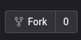

# Examen de Prog web 2

## L2 S4 automne 2022

Consignes :

- Forkez ce repository sur votre compte gitlab en utilisant le bouton Fork en haut à droite de la page.  
  
- Clonez le repository sur votre machine locale.
- Vous avez 1h30 (jusqu'à 9h30) pour réaliser l'examen. C'est l'heure des commits qui sera pris en compte.
- Vous avez le droit à toutes les ressources que vous voulez (internet, notes, votre projet, etc.)
- Utilisation de VSCodium obligatoire et le travail doit être réalisé sur un ordinateur de la fac.

### Exercice 1 - AJAX (10 points)

Dans le fichier `/assets/js/loadGame.js` :

- ajouter une fonction pour charger, avec ajax, les trois premiers jeux de la base de
  données : `/assets/db/database.sqlite`  (API = `/assets/actions/gameServer.php`). Ensuite les insérer dans le DOM,
  dans `main > section` du fichier `index.php`. (3 points)
- ajouter une fonction pour charger, en ajax, la quantité totale de jeux dans la base (
  API = `/assets/actions/gameTableSize.php`). (3 points)
- ajouter un événement sur le bouton "Load more" pour lancer la fonction créée au premier point. (1 point)

Dans le fichier `/assets/actions/gameServer.php` :

- utiliser le fichier `Database.php` pour charger les trois premiers films dans la base de données et les retourner en
  JSON. (2 points)

Dans le fichier `/assets/actions/gameTableSize.php` :

- utiliser le fichier `Database.php` pour charger le nombre de film total dans la base et le retourner en JSON. (1
  points)

### Exercice 2 - CSS (3 points)

Dans le fichier `/assets/css/index.css` :

- ajouter le style à la section pour permettre d'avoir un affichage avec trois cards par ligne sur desktop, deux sur
  tablette et une sur mobile.

N.B. : si vous souhaitez utiliser du SASS des fichiers sont à votre disposition dans le dossier `/assets/sass`, si
vous préférez travailler directement en CSS, vous pouvez utiliser le fichier `/assets/css/index.css`. Si vous utilisez
le fichier SCSS, vous devez compiler le fichier en CSS pour que les changements soient pris en compte et que je les
corrige.

### Exercice 3 - PHP (3 points)

Dans le fichier `/assets/actions/register.php` :

- ajouter une fonction qui permet d'insérer le nouvel utilisateur dans la base de données.
- ajouter une redirection sur la page de connexion si l'inscription est réussie ou sur la page d'inscription si elle
  échoue.

### Exercice 4 - HTML (2 points)

Dans le fichier `register.php` :

- ajouter un formulaire pour permettre à l'utilisateur de s'inscrire sur le site. Attention un style existe déjà,
  utilisez une structure pour permettre de l'adapter au mieux.

### Exercice 5 - Question (2 points)

Ci-dessous merci de répondre à ces deux questions (merci de répondre avec quelques mots simples et de ne pas
copier/coller, je ne souhaite pas de définition toute faite, mais une réponse personnelle) :

- Quel est le protocole utilisé pour communiquer avec le serveur ?
- JS est un langage asynchrone ou synchrone ? Expliquez.
